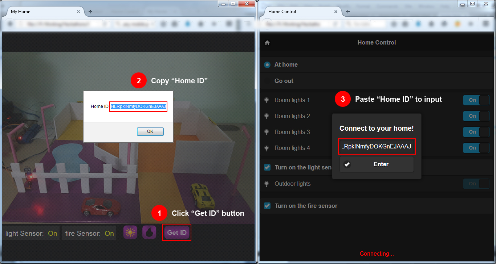

<h1>Smart Home With Openshift</h1>
<iframe width="560" height="315" src="https://www.youtube.com/embed/govJS8uFZMo" frameborder="0" allowfullscreen></iframe>
<h1>Demo:</h1>

Step 1: Open Smart Home: <a target="_blank" href="http://smart-home-demo-a1.0ec9.hackathon.openshiftapps.com/home">http://smart-home-demo-a1.0ec9.hackathon.openshiftapps.com/home</a>

Step 2: Open Home Control: <a target="_blank" href="http://smart-home-demo-a1.0ec9.hackathon.openshiftapps.com/">http://smart-home-demo-a1.0ec9.hackathon.openshiftapps.com</a>

<h1>Image:</h1>
